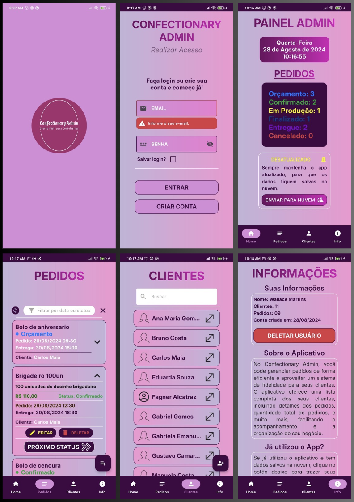

Não fala inglês? <a href="./README-pt.md">Clique aqui</a> para ver essa página em Português.

<h1 align="center">
  
Confectionary Admin

</h1>

## 💻 Project

In version 1.0, the app will be an essential tool for administrators in the confectionery industry, enabling them to efficiently track orders and manage clients in an organized manner.

## Features

- Order monitoring and tracking;

- Detailed view of orders, including name, description, price, status (Budget, Confirmed, In Production, Completed, Delivered, Canceled), creation date, delivery date, and client information;

- Order editing and deletion;

- Client loyalty system, with a list of clients and their respective information;

- Confirmation dialogs for sensitive actions;

- Local data persistence;

- Cloud data synchronization;

## Ideas Based on Interviews with Industry Professionals

- A comprehensive list of orders with the ability to filter by specific status;

- A progress button to advance the order status, with the option to manually edit the status in case of errors;

- Client loyalty: when creating an order, the administrator selects a client. When creating a new client, information such as Name, Email, Phone, Address, Gender, Date of Birth (for personalized messages), and Notes (preferences about the client) are collected. Promotions and discounts can be applied based on the number of orders placed, birthdays, among other factors. Technical notes: Each client will have, in addition to personal information, a list of placed orders and the total number of orders made.

- Local data backup to the cloud, ensuring the user can recover their information if the app is reinstalled, using a login system.

## Screens Details

- The app features a "Bottom App Bar" with the following options: Menu, Orders, Clients, Info;

- The home screen ("Home") will display a dashboard showing the current date and time, the number of orders by status, and a container with a message about synchronization, along with a button to sync local data to the cloud;

- In the "Orders" section, there will be a list of all orders, a filter option (by status or date - month and year), and the orders will be displayed in CARD format, which can be expanded to view details. A floating action button will allow adding new orders;

- In the "Clients" section, there will be a floating action button to add new clients, and the list of clients will be displayed in CARD format. By clicking on a client, a screen with their information will open, allowing the client to be edited or deleted, along with two additional buttons: "Save Changes" to confirm edits, and "View Orders" to view orders already delivered by that client;

- In the "Info" section, the screen will be divided into four parts: logged-in user information, app information, an option to sync data from the cloud to local storage, and developer information, including photo, name, age, area of expertise, and links for email contact and LinkedIn.

## Development Requirements

- Android Studio (IDE);
- Kotlin (Programming Language);
- Jetpack Compose (User Interface);
- Jetpack Security (Encryption);
- Compose Navigation (Screen Navigation);
- Hilt (Dependency Injection);
- MVVM (Architecture);
- Room (Local Database);
- Firebase (Authentication and Firestore as Cloud Database);

## 🔖 Layout

You can view an initial draft of the project layout through [this link](https://www.figma.com/design/1ePpKDDBsV50dEKt3cPUth/Confectionary-Admin?node-id=0-1&t=xPLcqNjJS2hsGzMx-0). This draft serves as a basic reference for the screen design. To access it, you need to have an account on [Figma](http://figma.com/).

## 📄 Licença

This project is licensed under the MIT License. See the [LICENSE](LICENSE.md) file for more details.

 
